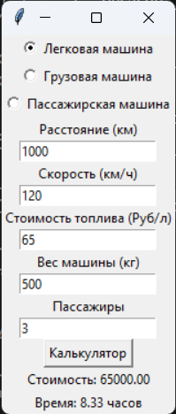

# Лабораторная работа №12
## Модули и пакеты c GUI
### Сложность: Rare
По своему варианту задания и GUI фреймворка создайте пакет, содержащий 3 модуля, и подключите его к основной программе. Основная программа должна предоставлять: графический пользовательский интерфейс с возможностями ввода требуемых параметров и отображения результатов расчёта.

### Вариант 4
**Автомобили**
+ Легковой
+ Грузовой
+ Пассажирский

Расчёт стоимости и времени поездки.

#### Оснавная программа
```python
import tkinter as tk
from transport.passenger_car import PassengerCar
from transport.cargo_truck import CargoTruck
from transport.bus import Bus

def calculate_transport():
    distance = float(distance_entry.get())
    speed = float(speed_entry.get())
    fuel_cost = float(fuel_cost_entry.get())

    if transport_var.get() == 1:  # Легковая
        transport = PassengerCar(distance, speed, fuel_cost)
    elif transport_var.get() == 2:  # Грузовая
        cargo_weight = float(cargo_weight_entry.get())
        transport = CargoTruck(distance, speed, fuel_cost, cargo_weight)
    elif transport_var.get() == 3:  # Пассажирская
        passengers = float(passengers_entry.get())
        transport = Bus(distance, speed, fuel_cost, passengers)

    cost_label.config(text="Стоимость: %.2f" % transport.calculate_cost())
    time_label.config(text="Время: %.2f часов" % transport.calculate_time())

root = tk.Tk()
root.title("Калькулятор для автомобилиста")

transport_var = tk.IntVar()
tk.Radiobutton(root, text="Легковая машина", variable=transport_var, value=1).pack()
tk.Radiobutton(root, text="Грузовая машина", variable=transport_var, value=2).pack()
tk.Radiobutton(root, text="Пассажирская машина", variable=transport_var, value=3).pack()

tk.Label(root, text="Расстояние (км)").pack()
distance_entry = tk.Entry(root)
distance_entry.pack()

tk.Label(root, text="Скорость (км/ч)").pack()
speed_entry = tk.Entry(root)
speed_entry.pack()

tk.Label(root, text="Стоимость топлива (Руб/л)").pack()
fuel_cost_entry = tk.Entry(root)
fuel_cost_entry.pack()

tk.Label(root, text="Вес машины (кг)").pack()
cargo_weight_entry = tk.Entry(root)
cargo_weight_entry.pack()

tk.Label(root, text="Пассажиры").pack()
passengers_entry = tk.Entry(root)
passengers_entry.pack()

calculate_btn = tk.Button(root, text="Калькулятор", command=calculate_transport)
calculate_btn.pack()

cost_label = tk.Label(root, text="Стоимость: -")
cost_label.pack()

time_label = tk.Label(root, text="Время: -")
time_label.pack()

root.mainloop()
```
#### Инструкция по запуску
1. Скачиваем основной файл и папку transport
2. Запускаем фаил через команду "python main.py" в терминале
3. В появивщемся окне выбираем тип автомобиля, вписывем расстояние которое предстоит проехать, среднюю скорость вашей машины, стоимость топлива в вашем регионе, вес машины и колличество пассажиров в ней.
4. На выходе получаем примерную стоимость и приблизительное время данной поездки

#### Пример заполнения программы.


<p style="text-align: center;">Рис. 1.</p>